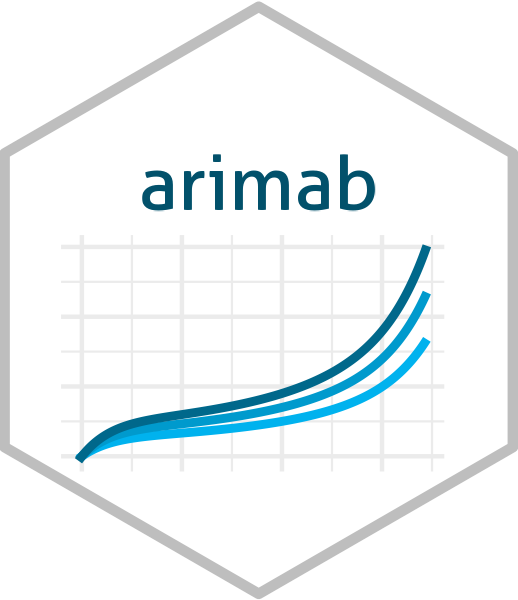

# arimab 


# Overview

The arimab is a wrapper of the r-base arima function with the addition of a formula to model the time series with inclusion of covariates in the model. In addition, the pre-bleaching method is added to analyze the correlation of covariates with the response variable.

# Installation

- CRAN

You can install the released version of rscript from [CRAN](https://CRAN.R-project.org) with:

``` r
# Wait.
```

- Github

Or install the development version of [Github](https://github.com/):

```
remotes::install_github("brunofariadf/arimab")
```

# Usage

This is a basic example that shows how to use a package function.

- R
``` r
# count line of code in the script
df_train <- arimab::bacen[1:100,]
fit_arima <- arimab::arimab(rate ~ arimab::lagb(inflation, -7), data = df_train)
summary(fit_arima)
# > summary(fit_arima)
# Call:
# arimab::arimab(formula = rate ~ arimab::lagb(inflation, -7), data = df_train)
# regression with auto.arima(3, 1, 2) errors
# 
# Residuals:
#      n     min  median    mean     max
#  93.00   -0.64    0.00    0.01    0.51
# 
# Coefficients:
#                             Estimate Std.Error t.value Pr(>|t|)
# ar1                          0.57515   0.09658   5.955 5.36e-08 ***
# ar2                         -0.26308   0.11364  -2.315  0.02297 *
# ar3                          0.53368   0.09926   5.376 6.30e-07 ***
# ma1                         -0.30371   0.04876  -6.229 1.62e-08 ***
# ma2                          0.93420   0.05484  17.036  < 2e-16 ***
# arimab::lagb(inflation, -7)  0.05795   0.01767   3.281  0.00149 **
# ---
# Signif. codes:  0 '***' 0.001 '**' 0.01 '*' 0.05 '.' 0.1 ' ' 1
# 
# sigma^2 estimated as 0.0356:  log likelihood = 20.24,  aic = -26.4
```

# Code of Conduct

Please note that the project is released with a [Contributor Code of Conduct](https://contributor-covenant.org/version/2/0/CODE_OF_CONDUCT.html). By contributing to this project, you agree to abide by its terms.

# License

MIT
